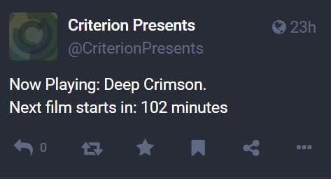

# Receive-CriterionNowPlaying

A PowerShell module and Mastodon bot that fetches the movie currently playing on the Criterion 24/7 streaming channel.

Follow here: [@CriterionPresents@cheddarcrackers.club](https://cheddarcrackers.club/@CriterionPresents)

## Why?

The Criterion Collection dedicates itself to distributing important classic and contemporary films. The company offers a streaming service, The Criterion Channel, that makes these films more accessible and affordable than buying individual Blu-rays. Subscribers of the service get access to Criterion 24/7 which is a continuous broadcast of films from the collection. A public website [whatsonnow.criterionchannel.com](https://whatsonnow.criterionchannel.com/) displays the movie currently playing along with how many minutes until the next movie begins. I wanted a way to get alerts when a new movie is playing so I could discover more movies within the collection.

## How?

[whatsonnow.criterionchannel.com](https://whatsonnow.criterionchannel.com/) is a simple website. It asks a question and answers it right away within the page's HTML. No extra DOM manipulations/javascript required. A simple web request with PowerShell parses the page easily. Well at least in PowerShell 5.1.

It turns out PowerShell Core does not have a built-in HTML parser so I had to utilize the PowerHTML module. I read that this feature was removed to ensure cross-platform compatibility. Apparently the parser in 5.1 utilizes Internet Explorer's engine. I guess I should be glad that Microsoft hasn't attempted to port Internet Explorer to Linux.

## Mastodon Bot Features

Running the bot will require Mastodon credentials. I use `Invoke-MastodonBot.ps1` in a GitHub workflow that runs once an hour. Movies typically last more than one so I added some logic to only create a new post if the movie has changed since the last time the script has ran. This is accomplished by storing the unix timestamp of when the next movie starts in `NextMovieTime.txt` and checking it against the current time.

I also have a script `Invoke-ForceMastodonBot.ps1` that will bypass this check and post regardless if the same movie is playing if I ever want the bot to do that for some reason.

### Example Post



## Example Local Command

I can also just run a script, `Invoke-CriterionChannelNowPlaying.ps1`, to simply check what is currently playing on Criterion 24/7 without involving Mastodon.

```PowerShell
PS C:\Users\judog\Documents\git\Receive-CriterionChannelNowPlaying> .\Invoke-CriterionChannelNowPlaying.ps1
Now Playing: The Hit.
Next film starts in: 75 minutes
```

## Notes

The Criterion Channel contains a lot of foreign films. Special characters do not always display correctly on [whatsonnow.criterionchannel.com](https://whatsonnow.criterionchannel.com/). For example, I have seen Peppermint Frappé as Peppermint FrappÄ. Currently, the bot just posts what it finds on the page so those errors currently persist.
